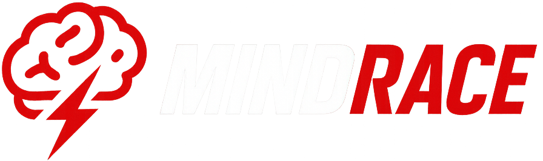
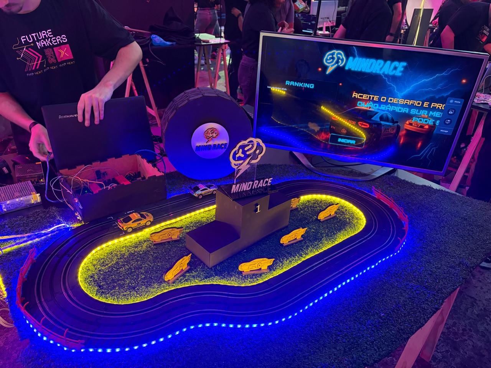

  

### 
 Autorama controlado pela mente

  <strong>Velocidade é foco. Controle é calma. Vitória é domínio mental.</strong>

  

---

## 🎮 Visão Geral

**MindRace** é um autorama competitivo onde os jogadores não usam controles físicos.  
Eles usam **ondas cerebrais**.

Cada jogador controla um carrinho em tempo real através de um **NeuroSky**, transformando estados mentais em ações diretas na pista.

---

## 🧠 Mapeamento Mental → Ações

| Estado Mental | Ação |
|--------------|------|
| 🧠 Concentração | Controla a **velocidade** do carrinho (PWM) |
| 😌 Relaxamento | Libera o **checkpoint** no meio da corrida |
| 👁️👁️👁️ 3 piscadas | Ativa um **boost rápido** |

### Checkpoint  
No meio da pista, o carrinho **para automaticamente**.  
O jogador precisa **relaxar até um nível mínimo** para continuar correndo.

---

## 🏁 Mecânica da Competição

- 2 jogadores simultâneos  
- 1 pista por jogador  
- Contagem automática de voltas  
- Ranking com os **10 melhores tempos do evento**  

📌 O ranking é salvo **localmente**, sem internet.

> Decisão técnica: evitar qualquer dependência online para reduzir ruído e instabilidade em ambiente de evento tech.

---

## 🔌 Arquitetura Eletrônica

### Componentes Utilizados

- 2 × Arduino Uno  
- 2 × Módulos Bluetooth  
- 2 × Sensores IR (contagem de voltas)  
- 1 × Ponte H (controle dos motores via PWM)  
- 1 × Step Down (12V → 5V)  
- 1 × Chave liga/desliga  
- 1 × Entrada de alimentação 12V  
- LEDs endereçáveis (feedback visual da corrida)

### Organização do Hardware

- 🛣️ **1 Arduino por pista**
- 📡 **1 módulo Bluetooth por Arduino**
- 🧠 **1 NeuroSky por jogador**
- ⚙️ Ponte H controla a velocidade dos carrinhos
- 🔢 Sensores IR fazem a contagem de voltas

---

## 🧩 Arquitetura do Sistema

NeuroSky
↓ (Bluetooth)
Arduino (Pista)
↓ PWM
Ponte H → Motor do carrinho
↓
Sensores IR → Contagem de voltas
↓
Site React (Feedback visual + Ranking)

---

## 💻 Interface Web (React)

Foi desenvolvido um site em **React** para feedback visual em tempo real, exibindo:

- 📊 Nível de **concentração**
- 😌 Nível de **relaxamento** (durante o checkpoint)
- ⚡ Barra de **boost** (cheia → vazia após uso)
- 🏆 Ranking Top 10 do evento

### Armazenamento

- `localStorage`
- Sem backend
- Sem APIs externas

Simples, confiável e estável para uso offline em eventos.

---

## 🎨 Identidade Visual

Inspirada em estética **cyber / futurista**:

- Neon azul e amarelo  
- Alto contraste  
- Luz como feedback cognitivo  
- Cérebro como símbolo central  

Elementos principais:
- Pista iluminada com LEDs
- Interface com efeitos de glow
- Branding focado em velocidade + mente

---

## 🧪 Tecnologias Utilizadas

- Arduino (C/C++)
- Bluetooth Serial
- NeuroSky MindWave
- React
- HTML, CSS, JavaScript
- PWM e eletrônica embarcada
- LEDs endereçáveis

---

## 🧠 Conceito Central

> Não vence quem acelera mais.  
> Vence quem controla melhor a própria mente.

O **MindRace** demonstra, na prática, a integração entre **neurotecnologia**, **hardware** e **experiência interativa**.

---

## 📸 Demonstração

  

